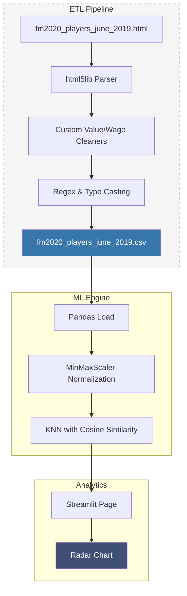

<div align="center">

# FM2020 Similarity Finder

### High-Dimensional Vector Search for Scouting Alternatives

[](https://www.python.org/)
[](https://scikit-learn.org/)
[](https://pandas.pydata.org/)
[](https://streamlit.io/)
[](https://plotly.com/python/)

**An interactive machine learning tool designed to identify matching player profiles within a 94k record dataset using 47-dimensional vector analysis.**

---

</div>

## Why I Built This

In the game Football Manager 2020, replacing a key player isn't always about finding a high-rated alternative; it’s about finding a "statistical twin" who fits the same tactical system. 

I built the **Similarity Finder** to move scouting from subjective opinion to mathematical certainty. By treating players as points in a 47-dimensional space, the system identifies replacements based on the **shape of their attribute spread** rather than just their raw ability level. This allows users to:
* **Discover Statistical Twins:** Utilize K-Nearest Neighbors to find players with nearly identical attribute distributions across 47 technical, mental, and physical attributes
* **Find Realistic Replacements:** Filter by Age, Market Value, and Wage to find affordable alternatives to superstars
* **Visualize Scouting Reports:** Instantly compare a target player against the original using overlapping radar charts to see how similar they are

---

## Skills Demonstrated

| Domain | Technologies & Concepts |
|--------|-------------------------|
| **Machine Learning** | K-Nearest Neighbors (KNN), Cosine Similarity |
| **Data Engineering** | Pandas, Feature Scaling (MinMaxScaler), Domain-Specific Attribute Mapping |
| **Data Visualization** | Plotly Interactive Radar Charts, High-Dimensional Data Plotting |

---

## Features

<table>
<tr>
<td width="50%" valign="top">

### Vector-Based Scouting
- Maps players across 47 technical and physical metrics
- Separated by outfielders and goalkeepers
- Implements MinMaxScaler for uniform weighting of attributes

</td>
<td width="50%" valign="top">

### Interactive Analytics
- Quantifies player similarity using a percentage-based index
- Real-time Plotly radar comparisons
- Styled Dataframes with player information

</td>
</tr>
</table>

---

## System Architecture



---

## Quick Start

### Steps

```bash
# Clone the repository
git clone https://github.com/Chazz236/FootballManagerSimilarityTool.git
cd FootballManagerSimilarityTool

# Install dependencies
pip install -r requirements.txt

# Start app
streamlit run similarity_tool.py
```

---

## What I Learned

### Data Engineering & ETL Pipeline
- Architecting a custom **ETL pipeline** to transform raw HTML table exports into structured CSV data
- Developing **specialized parsers** to normalize complex strings for machine learning
- Implementing **feature scaling** with **MinMaxScaler** to normalize 47 technical, mental, and physical attributes
- Designing a **dual-track preprocessing logic** to handle distinct Goalkeeper and Outfielder attribute sets

### Machine Learning
- Implementing **K-Nearest Neighbors (KNN)** to identify "statistical twins" within a **94,000-record dataset**
- Utilizing **Cosine Similarity** to prioritize attribute distribution ratios over numerical magnitudes
- Engineering a **similarity scoring system** by transforming distance metrics into quantitative benchmarks

### UI/UX & Data Visualization
- Visualizing high-density scouting data with interactive **Plotly multi-trace radar charts**
- Developing a **stateful dashboard** with **Streamlit** for real-time filtering of age, market value, and weekly wage
- Utilizing **Streamlit Fragments** to optimize UI performance and isolate visualization updates
